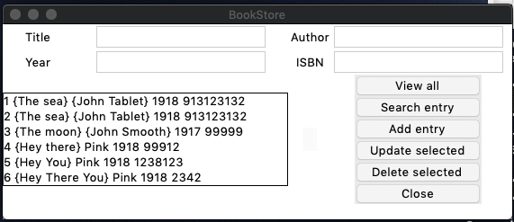

# Desktop Database Application
Database for books on Desktop. 
Application creates an app where you can put books details and they would be stored in SQLite (local) database.

### Installing
pip3 install sqlite3

### Libraries 
*tkinter 
*functools 
*psycopg2

### Running 
python3 frontend.py

### Application Outcome

